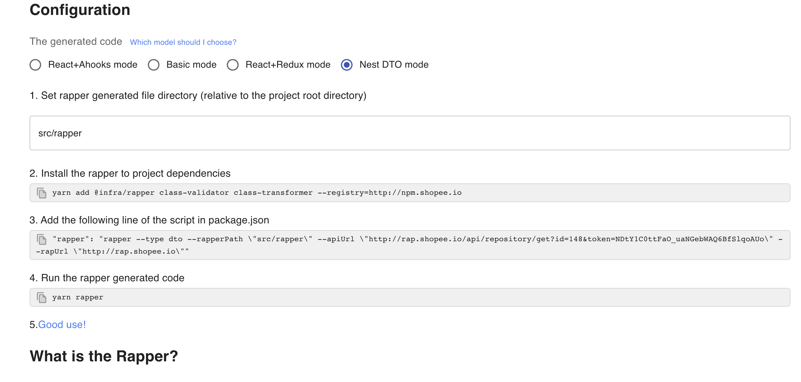

# Nest DTO Generation

This will generate Nest DTO file

### 1. Click `Generate TS code`


### 2. Select `Rapper3.0` & `Nest DTO mode`



## Install

```bash
yarn add @rapper3/cli class-validator class-transformer
```
