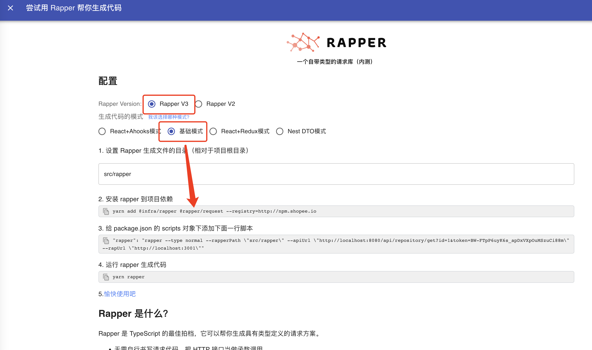

# Http

## @rapper3/request

<code src="./demos/http.tsx">

### 1. Click `Generate TS code`


### 2. Select `Rapper3.0` & `Basic Mode`



## Install

```bash
yarn add @rapper3/request @rapper3/cli
```

Except the TS defination file，it will generate `http.ts` file.

The `@rapper3/request` based on `axios`

## Usage

### http(url, payload, config)

> `http(url: keyof IModels, payload, config?: Omit<AxiosRequestConfig, 'method' | 'url'>)`

```ts
import { http } from './src/rapper'

async function Test() {
  /**
   * the same as: 
    axios('/api/get/users', {
      method: 'GET',
      params: { page: 1, pageSize: 10 }
    })
  */
  const res = await http('GET/api/get/users', { page: 1, pageSize: 10 })
  console.log(res.data)
}
```

> TS smart reminder in VsCode
>
> 
> 
> 

### http.get(url, payload, config)

> The same as `http(url, payload, config)`
> The difference is the `http.get()` will only show the `GET` url TS reminder
> 

### http.post(url, payload, config)

`http.post()` will only show the `POST` url in TS reminder

### http.put(url, payload, config)

`http.put()` will only show the `PUT` url in TS reminder

### http.delete(url, payload, config)

`http.delete()` will only show the `DELETE` url in TS reminder

### http.patch(url, payload, config)

`http.patch()` will only show the `PATCH` url in TS reminder

## Interceptor

`@rapper3/request` based on `axios`, so you can write interceptor as `axios`

### 1. Cofig baseURL

> `@rapper3/request` has the following baseURL configuration built in
>
> 

If you want to custom your baseURL，you can overider it as following

```ts
import { http } from 'src/rapper'
http.interceptor.request.use((config) => {
  config.baseURL = 'your baseURL'
  return config
})
```

### 2. Hanlde the response data

```ts
import { http } from 'src/rapper'
http.interceptor.response.use((response) => {
  if (response.code === 401) {
    // do something
  }
  return response
})
```
