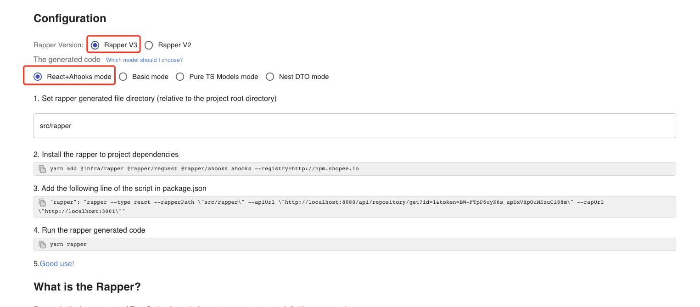
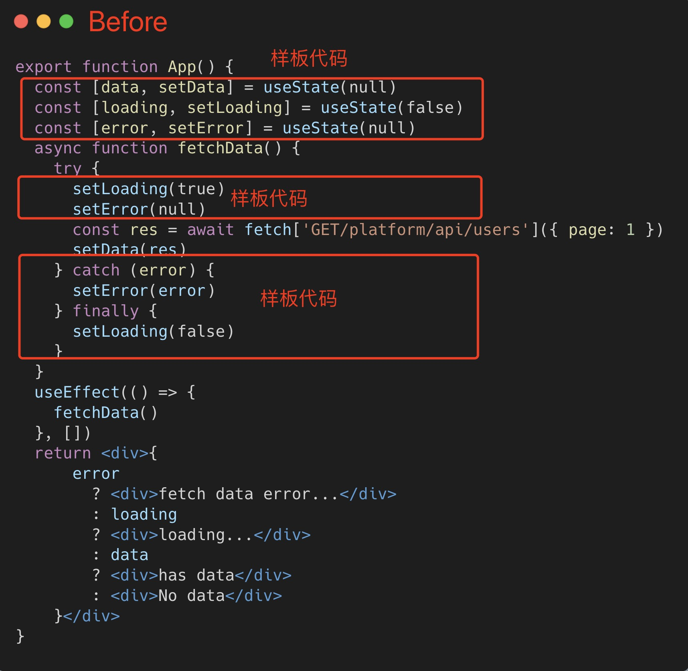
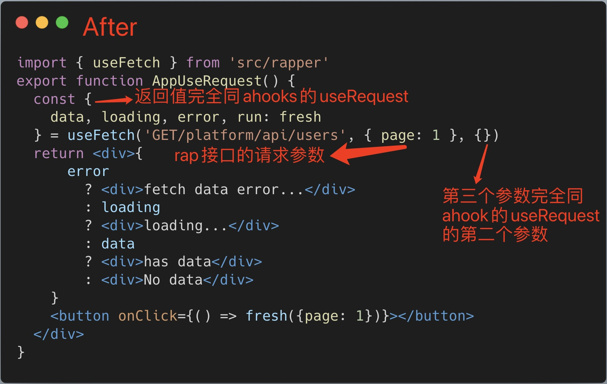
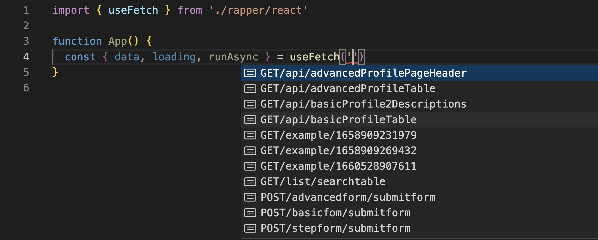
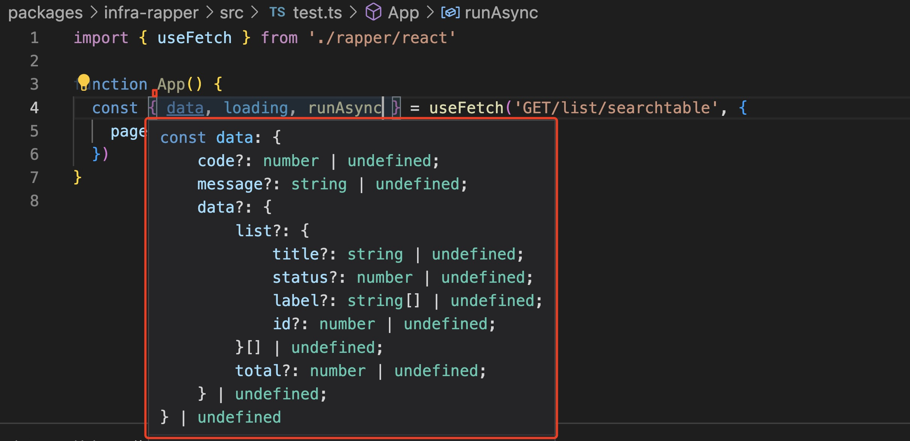

# React Hooks

## @rapper/ahooks

<code src="../demos/ReactHooks.tsx">

### 1. Click `Generate TS code`


### 2. Select `Rapper3.0` & `React + ahooks mode`



## Movitation

For React, we provide [ahooks useRequest](https://ahooks.js.org/hooks/use-request/index) as the default `Hooks Request`

`useRequest` Current features include:

- Automatic/manual request
- Polling
- Debounce
- Throttle
- Refresh on window focus
- Error retry
- Loading delay
- SWR(stale-while-revalidate)
- Caching

## Install

```bash
yarn add @infra/rapper @rapper/request
yarn add @rapper/ahooks ahooks
```

## Background

If you are using React in your project，we recommend Rapper + Hooks mode

> Here's a comparison




## Usage

The response is the same as [ahooks useRequest](https://ahooks.js.org/hooks/use-request/index)

```ts
function useFetch(
  url: keyof IModels,
  payload,
  options: IUseRequestOptions
): IUseRequestResult
```

- [IUseRequestOptions](https://ahooks.js.org/hooks/use-request/basic#options)
- [IResult](https://ahooks.js.org/hooks/use-request/basic#result)


<br/>

