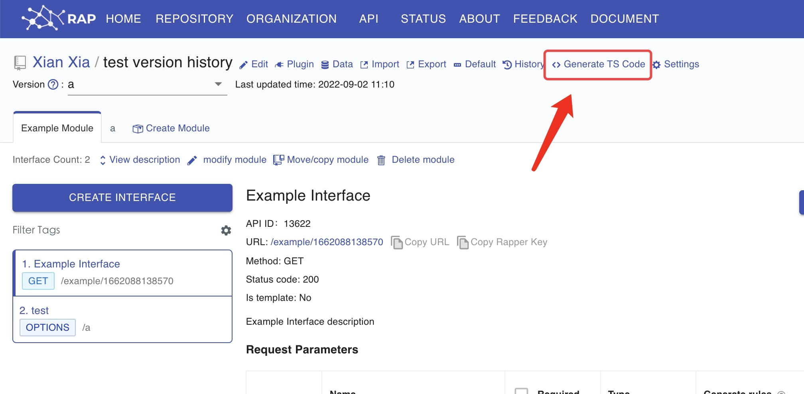

# @rapper/react-query

`@rapper/react-query` based on [@tanstack/react-query](https://tanstack.com/query/v4/docs/adapters/react-query)

### 1. Click `Generate TS code`



### 2. Select `Rapper3.0` & `Basic Mode`


### 3. Then install `@tanstack/react-query` & `@rapper/react-query`

```bash
yarn add @rapper/react-query @tanstack/react-query
```

### Tips

Remember to add `QueryClientProvider`. ([React Query Quick Start](https://react-query.tanstack.com/quick-start))

```ts
import { QueryClient, QueryClientProvider } from '@tanstack/react-query'

// Create a client
const queryClient = new QueryClient()

function App() {
  return (
    // Provide the client to your App
    <QueryClientProvider client={queryClient}>
      <Todos />
    </QueryClientProvider>
  )
}
```

## Usage

```ts
// utils.ts
import { http } from 'src/rapper'
import {
  createUseRapperMutation,
  createUseRapperQuery,
  createUseRapperQueries,
  createUseRapperInfiniteQuery,
  createRapperQueryOptions,
} from '@rapper/react-query'

export const useRapperQuery = createUseRapperQuery(http, {
  baseURL: 'your baseURL',
})
export const useRapperQueries = createUseRapperQueries(http, {
  baseURL: 'your baseURL',
})
export const useRapperMutation = createUseRapperMutation(http, {
  baseURL: 'your baseURL',
})
export const useRapperInfiniteQuery = createUseRapperInfiniteQuery(http, {
  baseURL: 'your baseURL',
})
export const op = createRapperQueryOptions(http)
```

### useRapperQuery

<code src="../demos/reactQuery/ReactQuery.tsx">

### useRapperQueries

<code src="../demos/reactQuery/ReactQueries.tsx">

### useRapperMutation

<code src="../demos/reactQuery/useMutation.tsx">

### useRapperInfiniteQuery

<code src="../demos/reactQuery/useInfiniteQuery.tsx">
