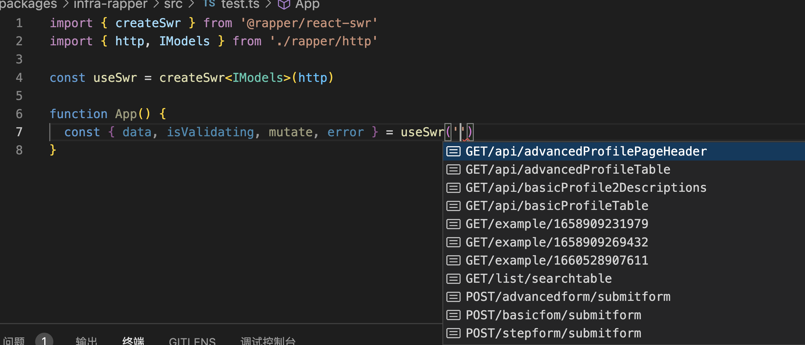

# @rapper3/react-swr

`@rapper3/react-swr` based on [SWR](https://swr.vercel.app/zh-CN)

<code src="../demos/ReactSwr.tsx">

### 1. Click `Generate TS code`


### 2. Select `Rapper3.0` & `Basic Mode`


### 3. Then install `swr` & `@rapper3/react-swr`

```bash
yarn add @rapper3/react-swr swr
```

## Usage



```ts
import { createSwr } from '@rapper3/react-swr'
import { http, IModels } from './src/rapper'

const useSwr = createSwr<IModels>(http)

function App() {
  const { data, isValidating, mutate, error } = useSwr(
    'GET/api/advancedProfilePageHeader'
  )
}
```
