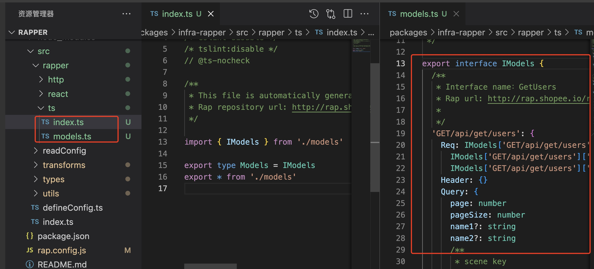
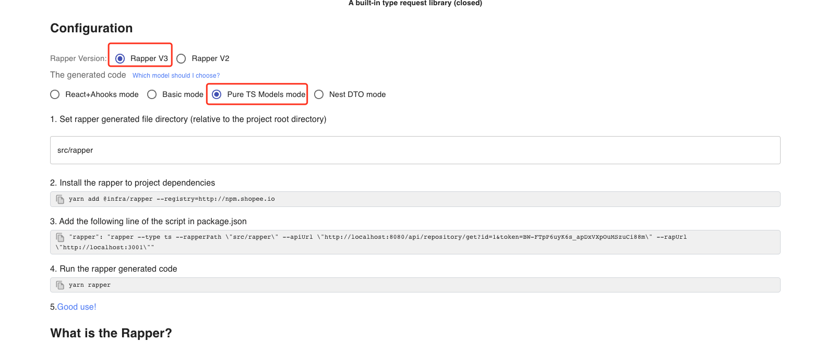

# Pure TS Models

This will only generate TS file

## Overview



### 1. Click `Generate TS code`


### 2. Select `Rapper3.0` & `Pure TS Models Mode`



## Install

```bash
yarn add @infra/rapper
```
