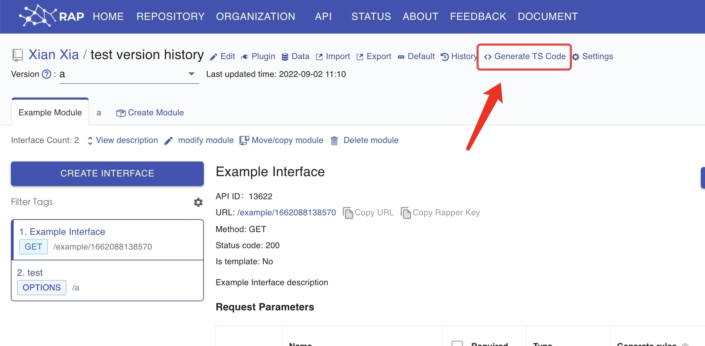
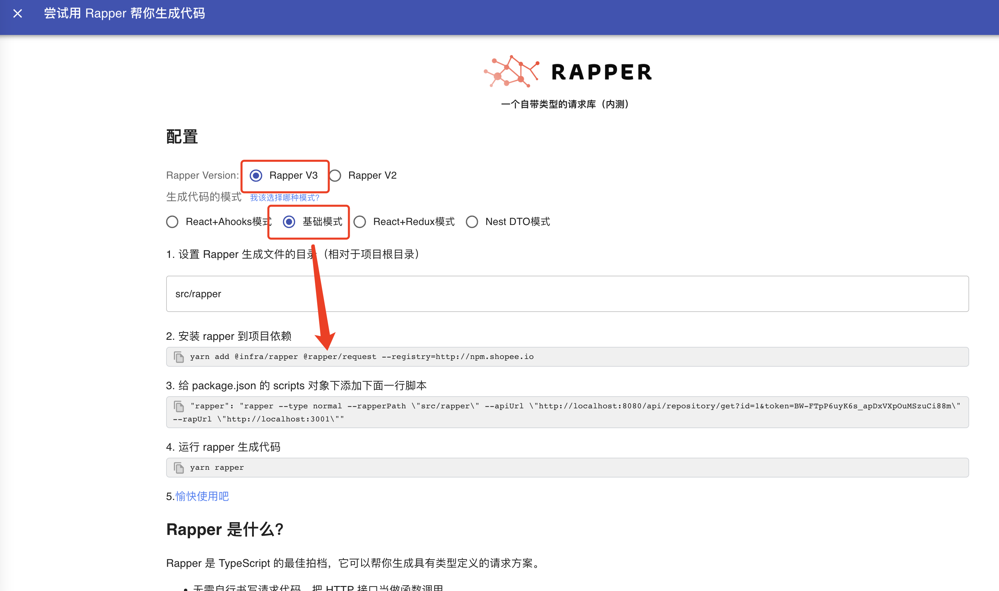
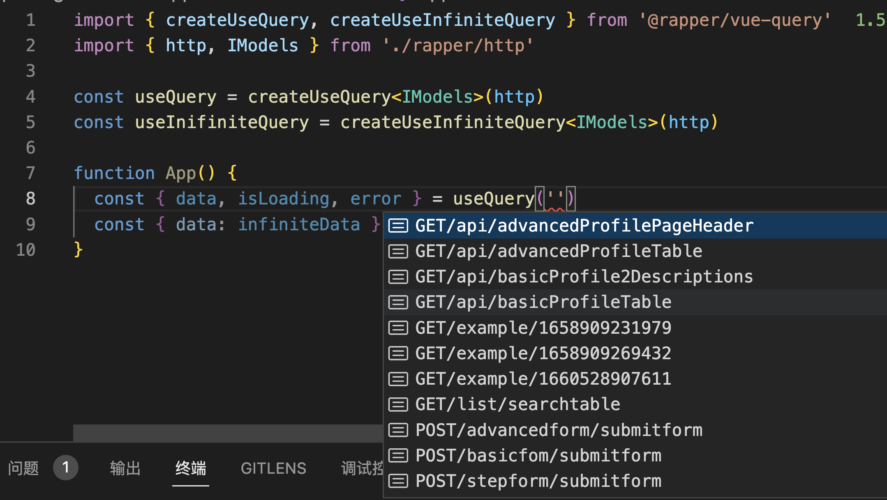

# @rapper/vue-query

`@rapper/vue-query` based on [vue-query](https://vue-query.vercel.app/#/)

## Http

### 1. Click `Generate TS code`



### 2. Select `Rapper3.0` & `Basic Mode`



### 3. Then install `vue-query` & `@rapper/vue-query`

```bash
yarn add @rapper/vue-query vue-query
```

## Usage



```ts
import { createUseQuery, createUseInfiniteQuery } from '@rapper/vue-query'
import { http, IModels } from './src/rapper'

const useQuery = createUseQuery<IModels>(http)
const useInifiniteQuery = createUseInfiniteQuery<IModels>(http)

function App() {
  const { data, isLoading, error } = useQuery('POST/advancedform/submitform')
  const { data: infiniteData } = useInifiniteQuery(
    'GET/api/advancedProfileTable'
  )
}
```
