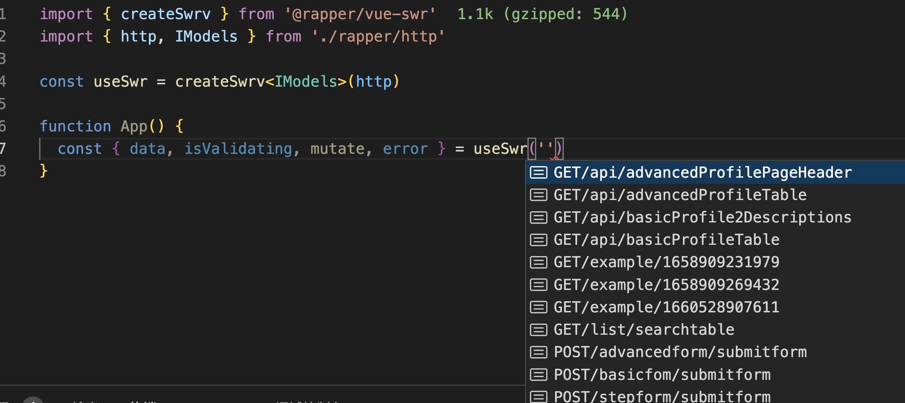

# @rapper3/vue-swr

`@rapper3/vue-swr` based on [swrv](https://docs-swrv.netlify.app/)

### 1. Click `Generate TS code`


### 2. Select `Rapper3.0` & `Basic Mode`


### 3. Then install `swrv` & `@rapper3/vue-swr`

```bash
yarn add @rapper3/vue-swr swrv
```

## Usage



```ts
import { createSwrv } from '@rapper3/vue-swr'
import { http, IModels } from './src/rapper'

const useSwr = createSwrv<IModels>(http)

function App() {
  const { data, isValidating, mutate, error } = useSwr(
    'POST/advancedform/submitform'
  )
}
```
